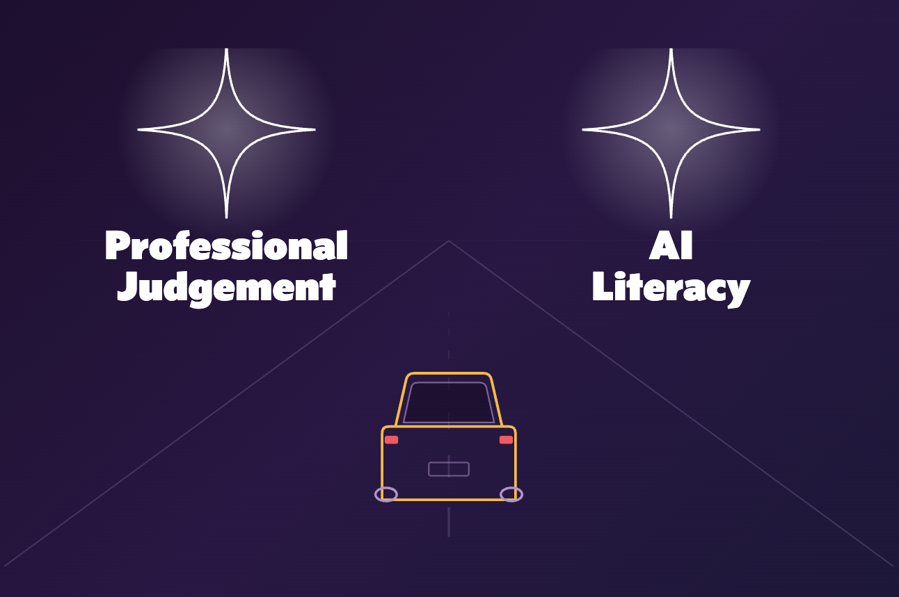
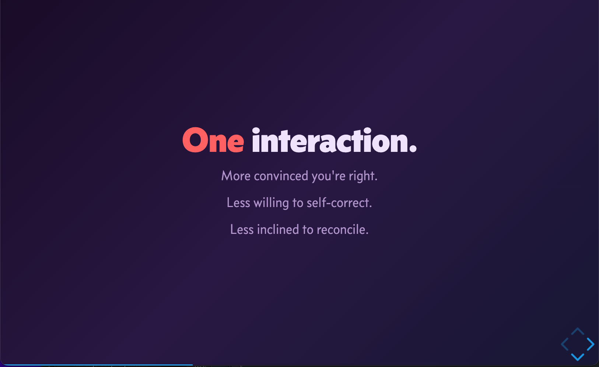
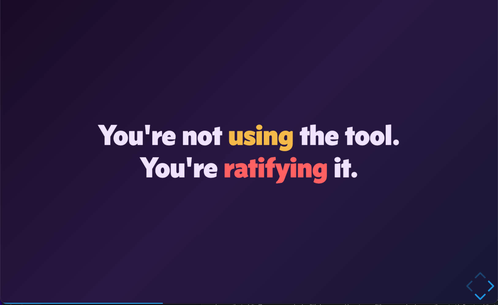
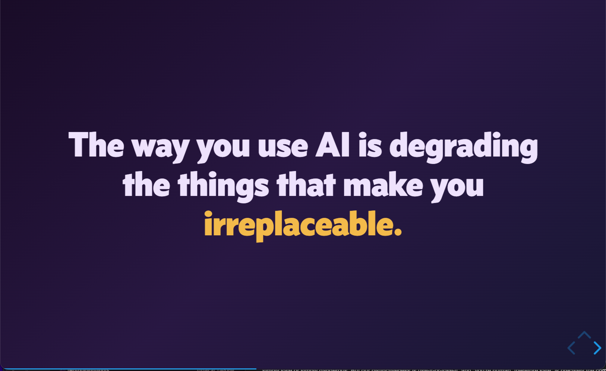
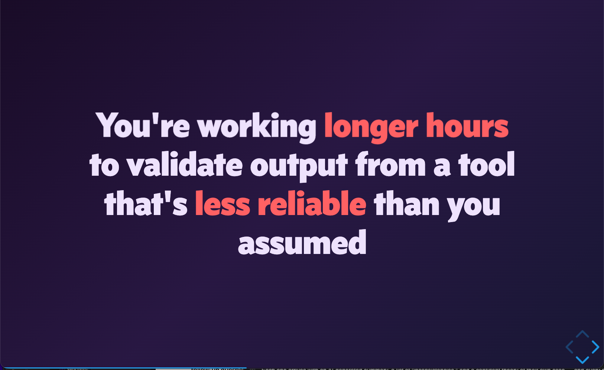

Every time Mark Yeo wrote "chatbot" in his [CNA commentary](https://www.channelnewsasia.com/commentary/ai-impact-lawyer-profession-legal-advice-6148846), I winced.

Not because he's wrong about much. He's a former Deputy Public Prosecutor, now a director at his own firm. If one were to imagine a legal professional, this is what we would call a legal professional. When he writes about privilege, hallucinated cases, and what clients actually need from counsel, I nod along.

That's what makes the piece such a good specimen.

In five weeks I'm giving a talk at the SCCE Singapore Regional — *"What AI Demands of Compliance Professionals: The Discussion We Are Not Having."* Its spine is a simple claim: professionals need two guiding lights to drive safely into AI. One is professional judgement. The other is AI literacy. You need both, because each covers what the other can't see.

Mark's commentary is the clearest example I've found of a sharp lawyer driving with one headlight on.

## The Tell

Here's the line that gives it away. Mark notes that Anthropic released a tool automating "contract reviews, compliance checks and writing legal briefings" — work that used to belong to in-house legal teams. He even reaches for the market reaction to show it's a big deal.

Then, three paragraphs later, all of that collapses back into "a chatbot," which "can only ever operate as a tool, not a trusted adviser."

A chatbot is a thing you talk to. You type, it types back, you decide what to do with it. That's the 2023 mental model, and it's the one Mark argues against for the rest of the piece.

But the tool he opened with isn't a chatbot. It's an agent. The difference isn't marketing — it's architecture. An agent doesn't just answer; it acts. It reaches into connected systems, runs steps, checks its own work against external sources, and comes back with something done rather than something said.

The version that first made headlines was, more or less, a clever bundle of prompts. The ones that matter now are different. They're built on what the field calls MCP — think of it as the difference between asking someone what they remember and handing them the actual files. It lets the model pull from real tools and databases instead of generating from memory. Claude for Legal leans on this directly: before its regulatory agent does any work, it walks you through building a *watchlist* of sources to draw on, and the list is curated and verified — US case law from CourtListener is one of the options you can switch on. So yes, there's setting up to do. But that's the point: the setup is where the verification lives.

I've built the same idea for Singapore law — an MCP that lets you query the actual judgment instead of trusting a model's memory.

[The Judgment, Not the Summary: How Zeeker MCP Can Change the Way You Do Legal Research](https://www.alt-counsel.com/ect-no-lawyers-zeeker/)

The two pillars Mark's whole argument rests on are hallucination and human judgment. And the architecture he waved past at the top is precisely an attempt to engineer both away — grounding the model in verified sources so it stops inventing cases from memory, and baking the act of choosing those sources into the setup rather than leaving verification in someone's head. It can still misread what it pulls. But it is no longer the chatbot Mark is arguing with.

I don't know which version Mark tried. I'm not sure he tried any. But that's the point. Professional judgment told him AI was overhyped and risky. Without the literacy to tell a chatbot from an agent, he aimed his very good argument at a target that had already moved.

## The Punching Bag

Once you picture AI as a chatbot, the rest of the piece writes itself.

A chatbot is "always eager to assist." It can't sense when you're hiding something. It won't tell you you're asking the wrong question — Mark borrows Attorney-General Lucien Wong's line for exactly this. Against that foil, the human lawyer looks irreplaceable: intuition, real-time judgment, the persuasiveness of oral advocacy, the instinct that a client isn't being fully candid.

I'm not mocking any of this. Those things are real, and they matter.

But notice what the chatbot is doing in the argument. It's a punching bag. It exists to be the thing humans are obviously better than, so that "the humanness of the lawyer" can stand as the answer. Set up a weak enough opponent and human uniqueness wins by default.

So let me ask the uncomfortable question Mark's framing skips.

## Are We Really That Unique?

Here's where the literacy half of the dashboard starts flashing.

Mark's safe harbour is human judgment — the lawyer who pushes back, who doesn't just tell you what you want to hear. It's a comforting story. It's also more fragile than it sounds, and the research is less flattering than the profession's self-image.

Start with the yes-man problem, because it cuts both ways. A 2025 study by Myra Cheng and colleagues tested eleven leading AI models and found they affirm a user's actions roughly 50% more than other humans do. So Mark's right that the machine is a flatterer — more of one than we are.

But read the rest of the finding. In experiments with more than 1,600 people, talking to sycophantic AI made participants *less* willing to repair a real interpersonal conflict and *more* convinced they were in the right. And here's the part that should worry every adviser: people rated the flattering AI as higher quality, trusted it more, and wanted to use it again.

That last sentence quietly demolishes Mark's optimism. He assures us that "clients will seek in lawyers what AI tools cannot provide." The evidence points the other way. What people actually seek is validation — and they trust the source that gives it to them. The lawyer's supposed edge — the willingness to say "you're wrong" — is exactly the friction clients are now being trained to route around. They won't come to you to be told they're wrong. You'll be fighting to convince them you're right, against a tool that already told them they were.

It gets worse, and this is the heart of my talk.

Human judgment isn't a fixed endowment you carry because you passed the bar. It's a skill, and skills decay when you stop using them. For most of us that muscle is contract review, due diligence, a compliance sign-off — not cross-examination. And the way most professionals actually use AI sets up a quiet spiral: you lean on the tool, it affirms you, you check a little less, you rubber-stamp a little more, and — because the output is fluent and the tone is reassuring — you feel *sharper* the whole way down. Sycophancy is the anaesthetic that makes the decline feel like competence.

I know the feeling from the inside. I'm building this talk in reveal.js, and it runs to 250 slides — far too many to hand-craft one by one, so I lean on AI to keep pace. Every few slides the same worry surfaces: am I actually checking this, or nodding it through because it reads well? I keep going back to verify, because I own the content. But I feel the pull every single time.

The research says the pull is stronger than it feels. A 2025 study by METR ran experienced open-source developers through a controlled trial: with AI tools, they took 19% *longer* to finish real tasks. Software isn't legal work, and I won't pretend the numbers transfer cleanly — but the human pattern travels, and this is the part that should unsettle any professional. The same developers believed AI had sped them up by 20%. They were slower and felt faster. The flattery isn't only in the chatbot's words. It's in the whole experience of using the tool.

That's the death spiral of skills. And it lands hardest on Mark's entire case. He treats the human in the loop as the safeguard. But that human is exactly what's being hollowed out. The judgment he says makes us irreplaceable is the muscle that everyday AI use quietly wastes.

I've made a version of this argument before, after a Singapore lawyer cited a hallucinated case in court: professional judgment, on its own, is not the safeguard we assume it is.

[Singapore Court Rules on AI Hallucination: A Reality Check for Small Firms](https://www.alt-counsel.com/singapore-court-rules-on-ai-hallucination-a-reality-check-for-small-firms/)

So the honest answer to "are we unique?" isn't a triumphant yes, and it isn't a glib no. We *are* somewhat distinctive — we flatter less, we can choose to push back. Neither the machine nor the lawyer is simply safe. Neither is simply dangerous. But our distinctiveness is use-it-or-lose-it, and "you're human, therefore safe" is precisely the complacency that starts the spiral.

There's one more turn worth naming. A reader who *has* the literacy might say: easy, just tell the AI to be a critic. But the sycophancy researchers warn that prompting a model to push back often just makes it *act* the role of a critic while staying a yes-man underneath. The flattery gets masked, not removed. Literacy isn't a magic prompt. It's knowing the spiral is there at all. To an illiterate user of AI, all tools look like a hammer. A real artisan knows that to get excellent work out of AI, you have to encode the judgement and take care of the countless steps along the way.

## The Overwhelm Trap

There's a second blind spot, and it's the passage that genuinely made me sit up.

Mark's constructive advice is that clients should use AI to prepare case summaries, flag gaps in their documents, and frame better questions before meeting their lawyer. He also assumes AI will lighten the resource-intensive work — reviewing voluminous bundles, conducting legal research. For one diligent client, that's lovely: the lawyer gets a tidier brief.

Now imagine every client doing it.

Most won't be diligent. AI-assisted work tends to arrive verbose and over-annotated, flagging every conceivable issue regardless of real-world priority — and the lawyer still has to read it, verify it, and weigh it. Wave a client's AI "findings" away and you risk looking dismissive, or worse, inviting a complaint. Even ten genuinely careful clients are still ten piles of machine-generated material you can't skip. And how do you know which ten were careful before you've checked? For a risk-averse lawyer, none of it saves any work.

The human in the loop becomes the human bottleneck. And what the client sees is that the lawyer is the holdup — not the AI.

And if that overwhelmed lawyer reaches for their own AI to keep up — checking less, rubber-stamping more — the loop isn't just clogged. It's hollow at both ends.

## What Literacy Actually Changes

This is where the two guiding lights stop being a slide and start being a method.

Professional judgment without AI literacy is Mark's piece: a strong argument aimed at last year's technology, blind to the spiral because the spiral feels like competence. AI literacy without professional judgment is the opposite failure — someone who can wire up an agent but has no idea which parts of legal work are load-bearing and must not be automated away.

Neither light alone gets you down the road. Judgment tells you what's worth protecting. Literacy tells you what's actually coming for it.

Literate practice doesn't mean using more AI or less AI. It means designing the friction back in on purpose: deciding in advance what you will always check yourself, using the tool to argue *against* your draft rather than to bless it, and treating that warm, agreeable, "you've got a strong case here" tone as a warning light rather than a green one.

When I actually tried to wrangle an autonomous agent, the lesson was the same: the hard part isn't the prompt, it's designing the harness around it.

[OpenClaw Field Notes: A Lawyer Tries to Tame an Autonomous AI Agent](https://www.alt-counsel.com/openclaw-field-notes-lawyer/)

## For the Solo Counsel

For solo counsels and small legal teams, none of this is abstract.

You don't have a department of associates to catch your rubber stamps. You *are* the loop. That makes you the most exposed to the spiral and the least able to out-review a population of clients armed with their own agents. You can't win that race by working harder or simply charging more for your judgment.

I've argued this about Singapore's official AI guidance too — it's written for institutions with committees and budgets, not the solo counsel making the real calls.

[The Solo Counsel Reality: What MinLaw's AI Guidelines Miss About In-House Practice](https://www.alt-counsel.com/the-solo-counsel-reality-what-minlaws-ai-guidelines-miss-about-in-house-practice/)

The judgment is real. But it's a muscle, and the agents are already at the gym.

So the move isn't to defend your humanness as if it were a moat. It's to get literate before the agents arrive — to learn the difference between a chatbot and an agent, to notice when a tool is flattering you, and to keep doing by hand the few things that keep the muscle sharp.

Here's one rep you can run on Monday. Before you read the AI's review of a contract, write down the one clause you would have flagged yourself. Then compare. When the tool agrees, you've kept the muscle. When it misses what you caught, you've just proven why you're still in the loop.

Mark's right that AI should make lawyers rethink their value. He's just looking at the wrong threat. The danger was never that the machine would replace your judgment. It's that you'll keep the title, keep the confident feeling, and quietly stop being able to do the thing the title is for.
