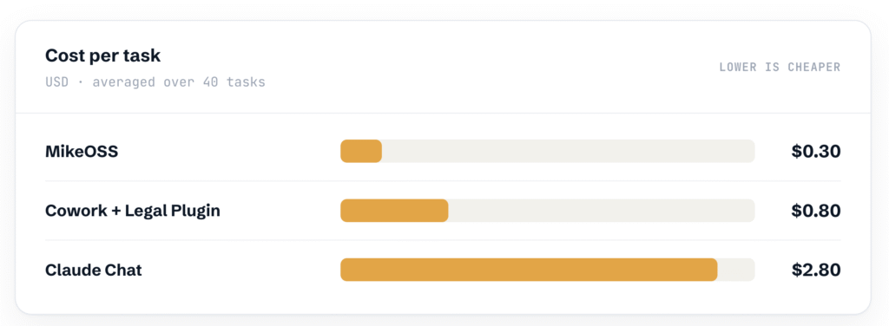

There’s a funny story about Microsoft. It’s a big enterprise company and many leading companies big and small use their services. It’s a huge monolith, so their history is replete with little apps that mimic popular apps. It keeps their customers happy within their walled garden, but somehow their attempts to re-create a popular app always disappoints.

Take Copilot Cowork for example. It’s an implementation of Claude Cowork, sure. But it’s connected to your enterprise data. Furthermore, it uses Anthropic models like Claude Opus 4.8. *I absolutely loved it*. I tell all my colleagues who had been disappointed at how the M365 chat or Copilot (or whatever name they have been calling it) to use it. They loved it too.  

As it turned out, all good things end miserably.

On 16 June, Microsoft pushed Cowork to general availability and put a meter on it — every model call, every document it reads, every tool it picks up, every minute it runs, billed in Copilot Credits at a cent each, on top of the $30 seat we were already paying.

I got rugpulled.

## A builder’s dilemma at work

Unfortunately, the stakes were higher on this issue. I had within a matter of weeks, built a contract reviewer on Copilot Cowork that my non-legal colleagues can run without me.

It reads an incoming contract, sorts the clear ones from the ones that need a human, and for the clean cases it gives a green light with a short explanation of why. The people using it don't have legal training. That's the point. It lets them clear the easy contracts themselves and only escalate what actually needs a lawyer.

[So you want to Claude Cowork the Legal Plugin?: A Guide](https://www.alt-counsel.com/so-you-want-to-claude-cowork-the-legal-plugin-a-guide/)

Now that Copilot Cowork will switch to usage based pricing, one might expect everyone to baulk at the pennies you have to spend every time you review a contract. The reality on the ground in a bigger organisation is more quaint. Our IT department, who manage the cost, still haven't worked out how to charge it back to the departments that use it. So for now it sits in limbo — and I'm the one footing the bill for my own use while that gets sorted out. And the limbo comes with a deadline: Microsoft gave us until 1 July to switch on usage-based billing or lose Cowork altogether.

I'd thought I was finally ahead of the wave. I'd built the thing that hands the boring triage to AI so a lawyer doesn't have to touch it — about as close as I'd come to automating a slice of my own job. Then the wave changed shape. So I did the only thing that made sense: I went to IT and told them plainly that Legal needs this and wants it properly implemented. Now I wait to see whether that carries. 

## I tried to put it back. They said no.

When the pricing changed, I asked the obvious question: should we just go back to the paid legal-tech tool we already license — the one we subscribed to for exactly this?

The answer came back that they would rather keep Cowork.

It isn't that the dedicated tool is worse. It's that Cowork is *there*. It's Microsoft, it lives in the chat app they already have open, and it's familiar in a way a purpose-built legal product never quite manages. We've tried other solutions. None of them beat the gravity of "it's already on the tab."

My colleagues didn't pick the best tool. They picked the one they'll actually use. And they're not wrong to.

## This isn't just us

Cowork isn't a one-off, and neither is my problem. The same few weeks felt like a turning of the season:

- Microsoft moved Cowork from a free-feeling preview to a metered GA.
- Legora moved its most capable product, Agent Pro, off per-seat pricing — about $3,000 a seat a year — to consumption.
- The pattern runs well past legal: even SAP is shifting enterprise software to consumption as agents eat the seat model.

And once you're paying by the task, *which* platform you run on stops being a detail. When the consultancy Legal Nodes put the same model — Claude Opus 4.8 — through three different setups on the same 40 legal tasks, the cost per task ran from $0.30 to $2.80. Same model. A near-tenfold spread, decided entirely by the scaffold around it — the prompts, integrations, and workflow design wrapping the model.

*Cost per task, same model across three platforms. Source: Legal Nodes scaffold study, via [Artificial Lawyer](https://www.artificiallawyer.com/2026/06/22/the-legal-ai-scaffold-changes-everything-claude-study/).*

Don't read that as a shopping list. The cheapest row, MikeOSS, is an open-source platform you host and wire together yourself — formidable if you build, useless if you don't. And these are tidy benchmark numbers; a real metered bill, which also charges for retrieval, tool calls, and runtime, runs higher than the model cost alone. The point isn't *switch to the cheap one*. It's that the same model can cost a little or a lot depending on the machinery around it — and someone has to judge whether that machinery is worth what it's metering.

Shawn Curran, the CEO of Jylo, [told Artificial Lawyer](https://www.artificiallawyer.com/2026/06/03/legal-ai-has-a-growing-token-price-problem/): "per seat pricing is gone, if Anthropic, Microsoft and OpenAI have moved away from it, no-one is going to subsidise legal tech vendors on all you can eat."

*The Lawyer* ran its version under a blunter headline: "Law's AI honeymoon is over." That's the consensus now. The free buffet is closing, and it's bad news for legal AI.

I think that read is short-sighted. But it took getting rugpulled to see why.

## The timing is the tell

Here's what nags at me. The meter didn't arrive after we'd figured out what legal AI is for. It arrived in the middle of the experiment.

My triage tool is months of figuring out what these things can and can't be trusted with. We are nowhere near done with that. Singapore's own guidance for the legal sector — [MinLaw's Guide for using generative AI](https://www.mlaw.gov.sg/launch-of-guide-for-using-generative-artificial-intelligence-in-the-legal-sector/) — only landed in March. Half the "legal-specific" features on the market are, as one founder told Artificial Lawyer, "innovation theatre and fear designed to justify pricing."

Free pricing was quietly doing the most important work in the industry: it let people experiment cheaply enough to find out what's worth doing. The meter taxes exactly that. It asks you to justify the spend while making the experiments that would justify it more expensive. You need the answer to afford the question.

Premature, then? Depends who you ask. From where I sit, watching a tool my colleagues only just started trusting, it's early. From the vendor's books it's overdue — they're bleeding on subsidised frontier tokens and can't carry it forever. Neither read is wrong. The honest question isn't "is it premature." It's "premature for whom."

But whichever way you answer, the same thing happened underneath the argument. The job of proving which legal use cases are worth it didn't disappear. It moved — off the vendor's books and onto mine. And now it has a price tag.

## The meter prices compute, not trust

The sharpest thing I read through all this came from someone sceptical of the whole shift. Writing about Legora's move, Elgar Weijtmans put it in four words I can't shake: consumption is not outcome.

[Legal AI Won't Be Priced Per Seat. Legora Just Agreed.](https://unfilteredbits.substack.com/p/legal-ai-wont-be-priced-per-seat)

You pay for the work the agent does, not for that work being right. The meter charges the moment the compute is spent. It has no opinion on whether the green light my tool just handed a contract was the correct call. That judgment isn't in the bill. It can't be.

I've written before that AI made building cheap but never made knowing what to build cheap. The meter is that idea with a price tag stapled on.

[When Building Gets Cheap But Knowing Stays Expensive](https://www.alt-counsel.com/when-building-gets-cheap-but-knowing-stays-expensive/)

So there's a gap — between what you paid and whether it was worth paying — and the vendor will not close it for you. Someone has to stand in it and say: this was worth the spend, and you can trust what came out.

## Where my judgment actually shows up

Watch what happens when the meter forces the question.

The moment Cowork's cost has to be allocated to a department, someone gets to ask: is this worth funding? Can we live without it? And the answer doesn't come from the dashboard. A number can tell you the contract reviewer cost so much last month. It cannot tell you the green lights were right, or that the thing is worth keeping.

I can. So the concrete, unglamorous way my judgment turns up is this: I tell the department that manages the cost what Legal thinks of the tool — that we use it, that we trust its triage, that it's the right direction. That one sentence makes it much harder for another department to wave the capability away as a feature they can live without.

That's the meter working as an honesty machine. It makes everyone ask "what can we live without," and that question quietly kills the demo-ware nobody will fund. But it also threatens the real, unglamorous capabilities that don't photograph well. The difference between the two isn't on the meter. It's a judgment call. And the person who can make it credibly — who did the legal work *and* built the thing — is the one whose vote moves the room.

An engineer can cost the workflow. A lawyer can judge the output. Only the lawyer-builder built it, judged it, and can stand behind it when the budget conversation starts. When AI felt free, none of this mattered; you could run it on everything and the bad bets hid in the flat fee. The meter ends the hiding. It turns my judgment from a private opinion into the thing that decides whether the tool survives.

I argued a while back that AI won't replace you — someone who decides will. This is what deciding looks like once it has a budget line: you say what's worth keeping, out loud, where it counts.

[AI Won't Replace You. Someone Who Decides Will.](https://www.alt-counsel.com/ai-wont-replace-you-someone-who-decides-will/)

I used to vouch with vibes. Now I vouch in a cost-allocation meeting.

## It's flawed. It's also what works.

I want to be honest, because the triumphant version of this post would be a lie.

I still think Copilot Cowork is flawed. I've used it long enough to have opinions, and the version we're metered on isn't the one I would design. But organisational reality means it's the easiest thing we have that actually works — familiar, already deployed, used without anyone being nagged. I don't get to hold out for the perfect tool. Neither do my colleagues. We get the one that gets used.

And the meter is not a gift basket for people like me. It's a harder game that happens to reward a skill I have. And I should be honest about what I can't prove yet: I've made the case to IT, but I may not be there when the final decision is made. Maybe the vouching tips it. Maybe they kill the line item and my judgment goes unheard — and "the most valuable person in the room" turns out to be the story I told myself while the tool sat in limbo. 

I might still be wrong, but I think it’ll tip. That’s because I am not arguing that Cowork is useful or impressive. I am saying it is worth paying for. As a real user, I had offered myself as an asset to the IT department. I care, a lot. 

## For the rest of us

Here's the part that should land for solo counsels and small teams: the buffet was never bottomless for you anyway.

You were always justifying every dollar. You never had the budget to spray expensive AI across every task to see what stuck. You already lived in the world where the question was "is this worth it" before you spent it. Metering doesn't trap you. It drags everyone else into the world you were already in — the one where judgment about what's worth doing was always the scarce thing.

For some people, the end of seat pricing is the end of the party, a cold reflection that AI is going to be out of reach. I feel it’s a new challenge, and I hope it will reward my judgement for the value it truly brings to the table. 
