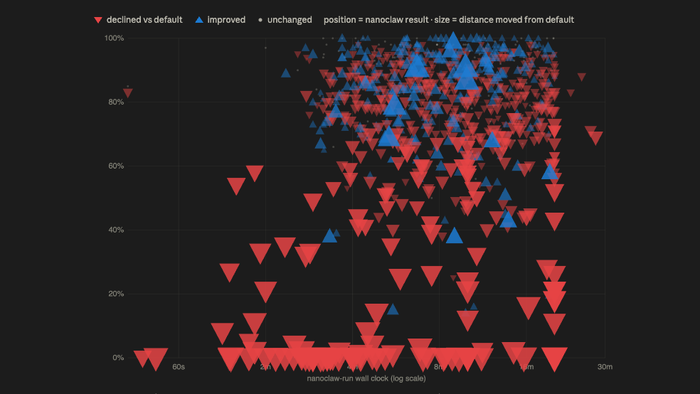

Somewhere in my benchmark results sits a complete legal memorandum. Fifty-eight kilobytes of finished work: issues identified, analysis done, recommendations made. Its score: zero.

Not zero because the law was wrong. Zero because my agent saved the memo as raw markdown under a `.docx` filename, the judge couldn't open it, and no criterion passed. The legal work was finished. Everything else around it failed. 

I found that memo because I went looking for why my agent stack confounded me. I had pitted a set of lawyer-made tools against a generic harness at legal work, and ran over 2,200 benchmark tasks to settle it.

My stack largely lost against the default. But what I learnt about the harness was the real lesson.

## What I actually ran

Three weeks ago, Harvey open-sourced its Legal Agent Benchmark (LAB): around 1,250 tasks across 24 practice areas, graded against more than 75,000 expert-written rubric criteria. Each task is a partner-to-associate assignment, built around a client matter: a fifty-word instruction, a closed universe of documents (some relevant, some deliberately not), and a requirement to hand back reviewable work product. One corporate M&A task, for example, gives the agent a data room for a fictional $458 million acquisition and asks for a board-ready memo on change-of-control provisions — graded against 57 separate criteria.

Grading is all-pass: a deal memo that catches eight of ten risks scores as incomplete, because that's how partners review work. The rubrics check facts, conclusions, citations, severity ratings, dollar amounts — and formatting. That last one matters for this story.

I ran the same model through it twice:

- **The stock harness** (1,251 tasks): LAB's default setup. Six generic tools — bash, read, write, edit, glob, grep — plus Pandoc (a document converter) and pdfplumber (a PDF reader).
- **My stack** (1,006 of the same tasks): the same model inside my nanoclaw container, wired to Adeu, an MCP document-authoring tool built by a fellow lawyer-coder, and docling, a library that converts PDFs and Office files into text an agent can read.

The model in both runs was DeepSeek-v4-flash through Ollama. Not a frontier model. Not a legal model. A model that costs approximately nothing — though each sweep exhausted a week of my Ollama token quota, so the experiment took two weeks for what frontier labs run in an afternoon.

My theory was simple: my agent would redline with a proper redlining tool and author Word files with a proper authoring chain, while the generic setup was left improvising with bash and Pandoc.

The results: the stock harness passed 84.7% of rubric criteria. My stack passed 74.8%. The stock harness produced 9 zero-score tasks; mine produced 56. Mine was also 2.6 times slower.

Ten points, in the wrong direction.

## The logs said something stranger

Encountering these results, your gut tells you a lot of things. DeepSeek-v4-flash is a terrible model. Maybe Adeu is not all it's cut out to be. Maybe nanoclaw is not a good place to run your legal bot. As the test did not isolate any particular factor, a definitive conclusion may not be forthcoming. But the logs still held lessons, and I enlisted Claude's newest "Fable" model to dig into the details.

The first discovery: my agent never once told me it was done. In the default harness used by Harvey, the harness owns the agent loop: when the agent stops calling tools, the harness knows directly that the run is over. That worked in all 1,133 of its runs.

Nanoclaw is different — it's a conversational agent, and the runner I wrote could only watch its messages. So I relied on the model to emit a `STATUS: DONE` string. It didn't work, because models don't reliably conform to their instructions. Instead I watched its deliverables, and deemed it done once they stopped changing. Sometimes the agent was not done — nanoclaw runs took longer, and I graded half-baked work instead. In one Stark Law task, the run was cut so early that the "gap analysis" my agent shipped was the *input compliance program*, verbatim. The stock run scored 1.00 on that task. Mine scored 0.00.

Then there were the files themselves. The stock harness produced 1,431 valid Word documents out of 1,431. My stack produced 73 broken ones — files with unescaped XML and leaked format tokens, placeholder stubs that literally read "PLACEHOLDER - This file will be generated via the Adeu MCP tool chain", and finished memos saved as text under `.docx` names, like the 58 KB one that opened this post.

And the discovery that actually stung: in 100 task folders, my agent had quietly routed around the document tools I gave it. It wrote its own Node.js scripts — `build-docx.js`, `transform.js` — installed `node_modules` *inside the deliverables folder*, and built its own document pipeline from scratch rather than use the MCP chain I'd wired up for it.

I gave my agent lawyer-made tools, and it preferred to improvise its own.

## Where my stack lost — and where it won

LAB tags every task with the kind of work an associate would recognise: draft, review, analyze, identify issues, extract, compare, research. Splitting the 1,006 shared tasks that way turned one ten-point gap into three different stories:

- **Drafting regressed worst: −12.9 points** across 374 tasks — and still −11.6 with every broken file excluded. Whatever my stack does when authoring long documents, the judge consistently liked it less.
- **Identify-issues and analyze tasks lost mostly on packaging.** Excluding broken files cuts the identify regression from −9.9 to −4.7 points. The legal thinking was largely intact; the memos didn't survive delivery.
- **Extract and compare tasks flipped: my stack won.** More perfect-score extractions (3.2% vs 1.6%) and comparisons (7.0% vs 5.4%) than the stock harness managed.

The pattern: my stack is better at mechanical work and worse at composition. And the composition damage concentrated exactly where a fragile authoring pipeline would compound — funds and corporate-governance drafting, the longest and most heavily structured documents in the benchmark, fell 33 and 28 points in those cells. Meanwhile litigation, IP, and trade-sanctions tasks barely noticed the change of harness.

A single leaderboard number would have flattened all of that into "your stack is worse." The breakdown says something far more useful: it tells me what to fix, what to keep, and where my stack is already the better environment.

## It wasn't the model. It wasn't the tools either.

Here's where the post I planned to write — my nanoclaw stack declaring total victory over Harvey's basic harness — fell apart. The harness turned out to be made of many little things, and nothing I swapped or added came with any guarantee of improving the result. This was the jagged frontier — AI capability strong in one spot, weak in the next — vividly illustrated for me.

It is hard going when one person is the engineer, the lawyer, the tester, and the QA department. I have regrets; a more careful design would have bought firmer conclusions. 

When I went looking for whether anyone had measured this properly, I found a whole research field arriving at the same place. Princeton's Holistic Agent Leaderboard team ran 21,730 agent rollouts and found the *same model* swinging up to 48 percentage points depending on which scaffold wrapped it. A position paper published last month — bluntly titled "Stop Comparing LLM Agents Without Disclosing the Harness" — puts numbers on it: on SWE-bench Pro, a leading coding benchmark, six frontier models span just 4.9 points under a single locked harness, while one of them (Claude Opus 4.5) moves 9.5 points when you change only the harness around it.

Read that again: the gap between harnesses was twice the gap between the best and worst frontier models. My ten-point gap, on legal work, with the model held constant, is the same finding.

There's another lens, though. I now have a path to improve the scores — skills, more tools, even extended thinking, which is essentially throwing more tokens at the problem. That path is open to anyone, including the AI itself. This is why Kevin Keller calls the harness the floor: table stakes for any AI.

## When someone shows you a benchmark score

For solo counsels and small teams, this changes how to read every legal AI claim. Every benchmark score is jointly produced by a model and a harness, and the harness is the part nobody discloses. When a vendor says "our system scores X on legal tasks," the polish of their harness — the completion logic, the document writers, the retry behaviour, the packaging validation — is baked invisibly into X.

Harvey seems to understand this better than its marketing peers: LAB launched deliberately *without* a leaderboard because Harvey first wants standards for normalising submissions — an admission that nobody yet knows how to compare agent results fairly across stacks. I'd put it more strongly. Benchmarks like this don't favour frontier *models* so much as they reward polished *harnesses* — which frontier labs and well-funded vendors have, and the rest of us have to build on weekends.

The same problem shows up at the product level, closer to home. Anna Guo, a Singapore-based in-house counsel, runs LegalBenchmarks.ai — double-blind evaluations of legal AI tools, scored by panels of practising lawyers. Her findings rhyme with mine: general-purpose chatbots matched purpose-built legal tools on raw accuracy, and one of her documented failure modes is tools failing "not because of poor reasoning but due to technical constraints" — file formats, upload limits, OCR — sometimes silently. The product world calls that usability. The agent world calls it the harness.

So before trusting any agent benchmark number, I now ask three questions:

1. **What harness produced this score?** Same model, different wrapper, ±10 points or more.
2. **Who decided when each run ended?** If the harness guesses, some runs died mid-thought — that's how a verbatim copy of an input document became my agent's "gap analysis."
3. **What happened to outputs that failed packaging?** A zero might be wrong law — or finished law in a file the judge couldn't open.

None of these appear on a leaderboard. All of them moved my results more than the model did.

## Before I blame anyone's code

Determining a winner in head-to-head battles isn't the only thing stressing a harness under Harvey LAB's 1,000-plus tests is good for.

While my integration is clearly to blame for some of the failures — my completion signal, my stability gate, my conversion step that never ran — there are other factors, such as Adeu, an open-source tool that allows AI agents to freely edit a document, including redlining.

There is something intriguing about what's going on behind the scenes. So here's my plan: study where Adeu appears to have failed, reproduce the error, and contribute back — an upstream bug report with a thousand runs of forensics attached, instead of a vague complaint that it "didn't work."

I once wrote that legal open source is a federation of solo-author archipelagos — projects that never receive the outside contributions that would make them a community. Bob Ambrogi quoted that line back at me when LAB launched, asking whether Harvey's benchmark would leave room for outsiders to shape it. Fair question. But contribution has to flow both ways — not just maintainers publishing code, but users reporting back. A stranger running your tool through 1,006 legal tasks and filing detailed bugs is what the alternative to open-source theatre actually looks like. I'd rather be that stranger than another archipelago.

## The benchmark was the product

I set out to prove my stack was better and got something more useful: the most thorough QA report my agent has ever had, nearly free. Harvey built a 75,000-criterion test suite with frontier-lab research partners; running it cost me two weeks of Ollama token quota and one credit outage. It found four real bugs in my harness that no amount of demo-driven tinkering would have surfaced, told me exactly which work types my stack is already good at, and handed me a fix list with measurable recovery criteria.

For now, the lesson I keep returning to is the one the 58 KB memo taught me. The work was good. The environment failed it. Every leaderboard score you've ever seen contains both, blended invisibly — and the same is true of your own agents.

What is your harness quietly deciding for you?
