Legal Tech LinkedIn went nuts lately when they noticed Anthropic's legal plugin tucked away in their "knowledge workers" repository. The markets also took notice as many "traditional" legal tech vendors saw their stock prices drop, including Thomson Reuters which saw a drop of 16% in a single day.

So is this panic justified? Is this the end of the world for legal tech now that Anthropic has eaten their lunch?

Here's what no one's talking about: the plugin is open source. You can look inside. You can modify it. You can make it work for your purposes and jurisdiction.

The templates it ships with are US/EU-centric. For a Singapore or any other practitioner, that's a starting point, not a solution.

I spent the weekend actually using it. This guide walks you through getting it running, then shows you how to create your first custom template: a PDPA-specific data subject access request response. No coding required—just markdown files you can read and edit.

## A primer on Claude Cowork and Plugins

Let's set the stage first.

Claude Cowork is Anthropic's desktop application for running AI-powered workflows. Think of it as Claude with superpowers: it can read files on your computer, execute multi-step tasks, and work with specialized plugins.

Plugins are pre-built skill packages that teach Claude how to do specific jobs. Anthropic released 11 open-source plugins covering areas like sales, marketing, finance, and—most relevant to us—legal work.

The legal plugin gives you five slash commands:

* `/review-contract` — clause-by-clause review against your playbook
* `/triage-nda` — quick categorization: auto-approve, review, or escalate
* `/vendor-check` — status check on vendor agreements
* `/brief` — daily briefings, topic research, incident response prep
* `/respond` — templated responses for DSARs, legal holds, common inquiries
For solo counsels and small teams, these commands offer a new way to use AI without specialized tools or enterprise platforms.

## What you'll need

**Time required:** 30-45 minutes for setup; about 2-2.5 hours to follow the full walkthrough including validation and branding

**What you'll need:**

* A computer running macOS or Windows (Windows 10 or higher)
* A Claude Pro, Team, or Enterprise subscription ($20/month for Pro)
* Some familiarity with creating folders and editing text files
Don't be daunted by that last requirement. The customizations are in plain text, not code. If you can find your way around your computer using Finder (macOS) or File Explorer (Windows), you can customize these skills.

<details>
<summary>A note before you start</summary>

I'm skeptical about Cowork as a daily workflow tool. Integration friction (copy-paste between systems) and data security concerns make it impractical for confidential legal work. Use public documents only (like the VIMA NDA in this guide) until you've completed your organization's vendor assessment for Anthropic.

But the *meta-prompting* techniques you'll learn here—creating reusable instruction sets that guide AI behavior—apply beyond Cowork. These patterns work in Claude Code, API implementations, and other tools that adopt similar approaches.
</details>

<details>
<summary>The trade-off with Vendor tools</summary>

Vendor tools like Harvey or CoCounsel come with enterprise support, compliance teams, and predetermined workflows. Custom skills and templates require more self-reliance but give you control over the decision-making logic. For solo counsels and small teams working on internal processes, custom approaches are manageable. For client-facing work requiring compliance certification, vendor tools often make more sense—at least until you build confidence on lower-risk tasks.

That's what makes this worth your time: learning how to program your own systems, not just work within someone else's.
</details>

## Step 1: Install Claude Cowork

**1.1** Go to [](https://claude.ai/download) and download the desktop app for your operating system (macOS or Windows).

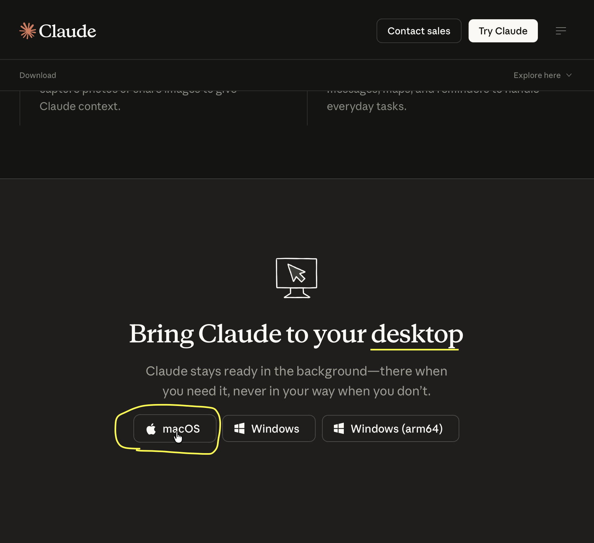

**1.2** Install the application:
- **macOS**: Open the .dmg file and drag Claude to your Applications folder
- **Windows**: Run the .exe installer and follow the installation prompts

**1.3** Open Claude and sign in with your account. You need a Pro, Team, or Enterprise subscription—Cowork isn't available on the free tier.

**1.4** Once signed in, you'll see three tabs at the top: **Chat**, **Code**, and **Cowork**. Click **Cowork**.

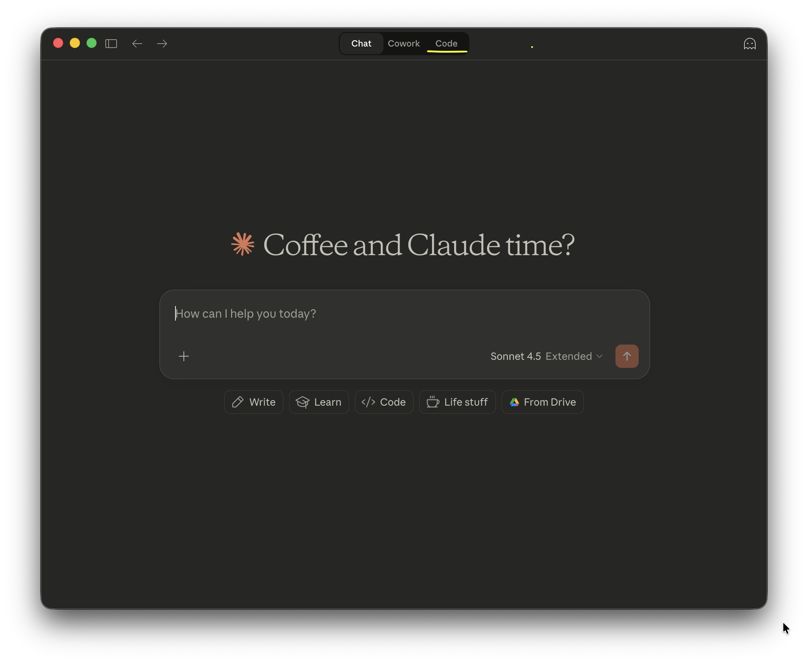

*Note: The interface looks identical on both macOS and Windows, so these screenshots apply regardless of your operating system.*

If you've set up your account and followed the steps above, you'll arrive at this interface:

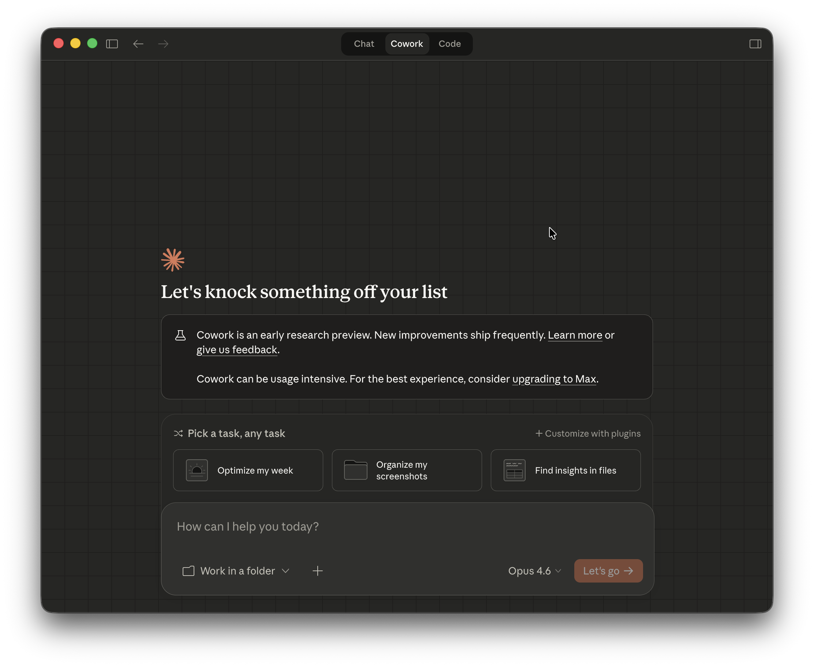

## Step 2: Install the Legal Plugin

There are several ways to install plugins (including via terminal), but let's use the quickest method.

**2.1** In Cowork, click on the `+ Customize with plugins` button.

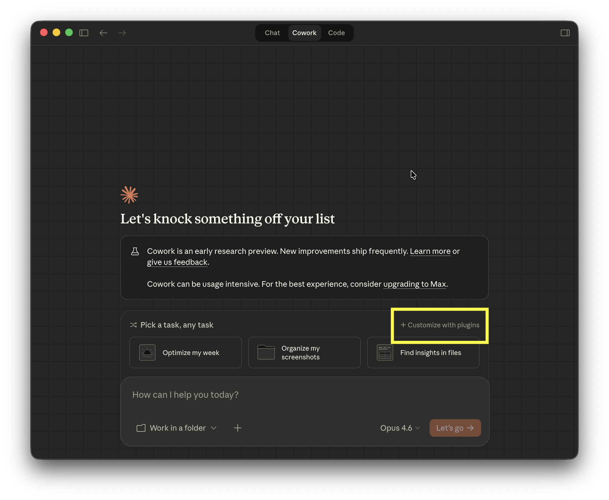

**2.2** You'll see the plugin marketplace. Find **Legal** in the list and click **Install**.

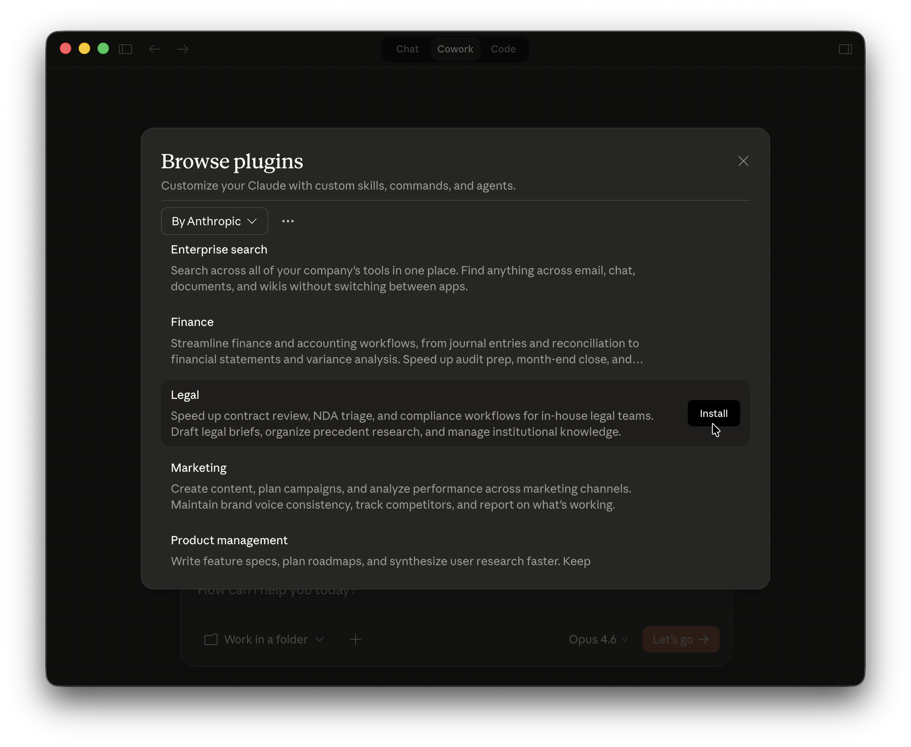

**2.3** The plugin will download and activate automatically. You should see a confirmation message.

**2.4** When you return to the Cowork screen, you should see the available legal commands:

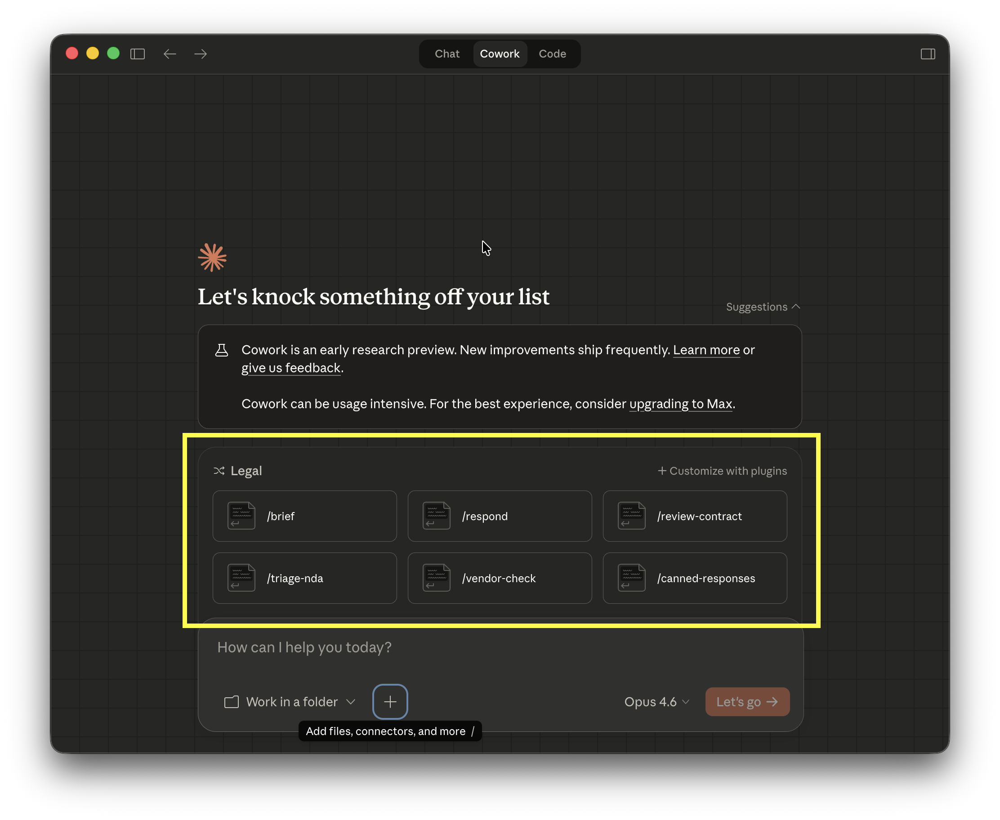

You now have Cowork with the legal plugin enabled.

## Step 3: Quick Demo - NDA Review

Before we customize anything, let's see what the plugin does out of the box.

**3.1** Download the [VIMA 2.0 Model Non-Disclosure Agreement ](https://www.google.com/url?sa=t&source=web&rct=j&opi=89978449&url=https://www.svca.org.sg/sites/default/files/2022-09/VIMA%25202.0%2520Model%2520Non-Disclosure%2520Agreement%2520%25282019%2520updated%2529.docx&ved=2ahUKEwjyx5DNu8aSAxXyxzgGHU2BLg8QFnoECAwQAQ&usg=AOvVaw1tvG4_VmRdot2xTBM6gcxC)to your computer (probably your Downloads folder).

**3.2** In Cowork, click the `+` button next to `Work in a folder` and add the NDA file to your session.

**3.3** Type this command:

```

```

You should see the `/review-contract` command highlighted. Click `Let's Go`.

It may take a while to process, but Claude will deliver a risk assessment with warnings and negotiation priorities.

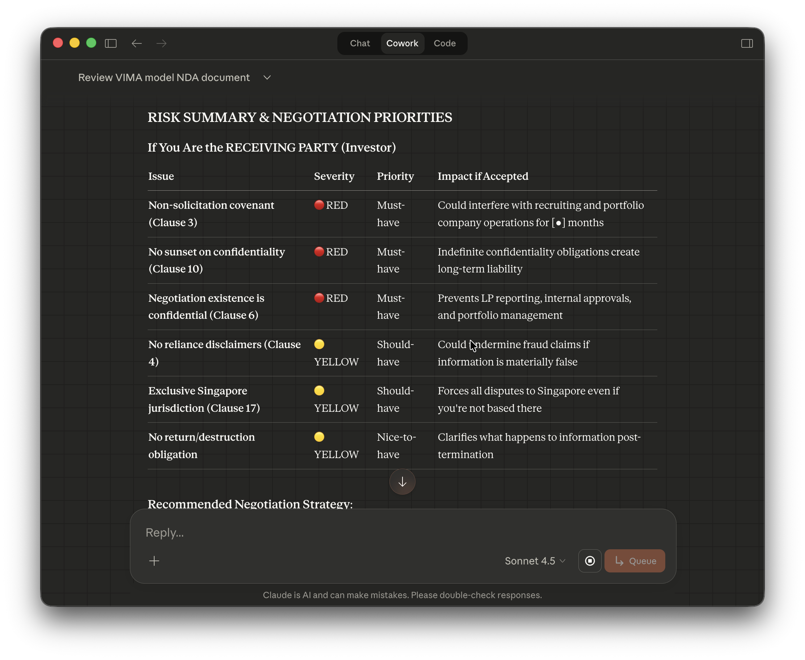

That's useful. But it's generic advice—the kind you'd get from Claude chat. The real value comes from customization.

## Customizing for Your Jurisdiction: PDPA DSAR Template

Here's where it gets interesting. The plugin ships with templates for common legal tasks, but they're built for US/EU contexts. If you work in Singapore, you need PDPA-compliant responses, not GDPR templates.

This is where solo counsels get leverage. Let's create a Singapore-specific data subject access request (DSAR) response template.

## Understanding the `/respond` command

The legal plugin includes a `/respond` command that uses template files to generate responses for:

* Data subject access requests (DSARs)
* Legal holds
* Vendor inquiries
* Common legal questions
These templates live in markdown files you can read and modify.

### Step 1: Set up your workspace

**1.1** Create a new folder somewhere accessible—I'll use `Documents/Legal-Skills`.

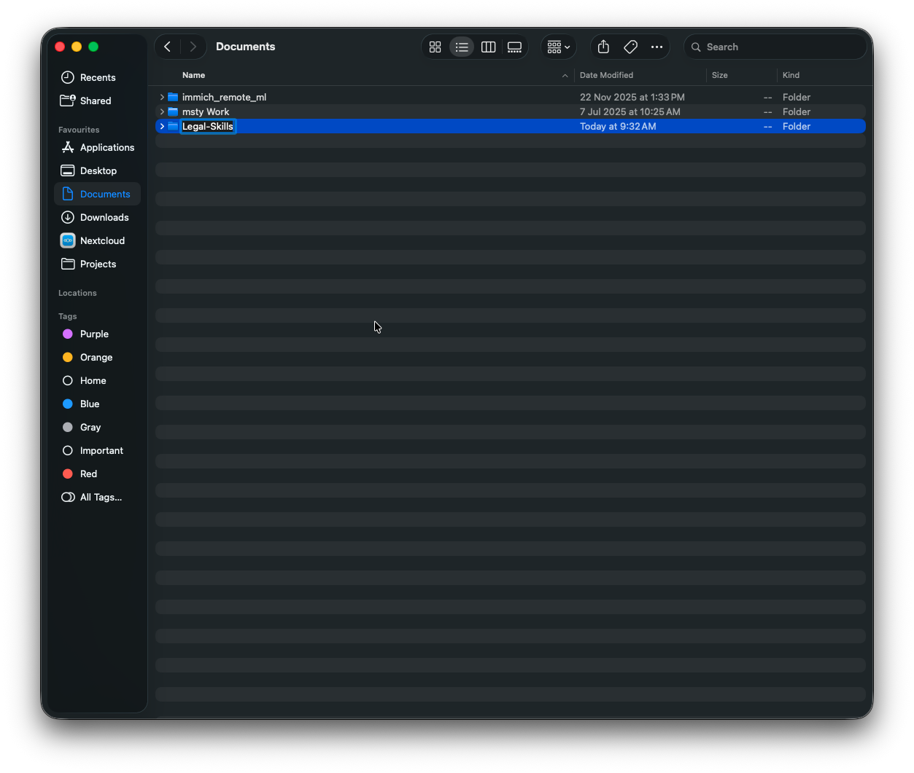

**1.2** Inside this folder, create a new text file called `PDPA DSAR Response.md`.

Open a plain text editor (like TextEdit on macOS or Notepad on Windows) and save the file as 'PDPA DSAR Response.md' in the folder you created. Make sure to save as plain text format—not Rich Text or other formatted text.

### Step 2: Build the PDPA DSAR template

Open `PDPA DSAR Response.md` in your text editor and paste this template:

```markdown

```

### Step 3: Validate Against Regulatory Guidance

**3.1** Download [the guide from the PDPC](https://www.pdpc.gov.sg/-/media/files/pdpc/pdf-files/other-guides/guide-to-handling-access-requests-v1-0-(090616).pdf) which details the regulator's recommendations on how to handle DSARs.

**3.2** In a new Cowork session, click the `+` button and add both the PDPC guide and your `PDPA DSAR Response.md` file to the chat.

**3.3** Type this command: `Review @PDPA DSAR response.md after reading the attached guide.`

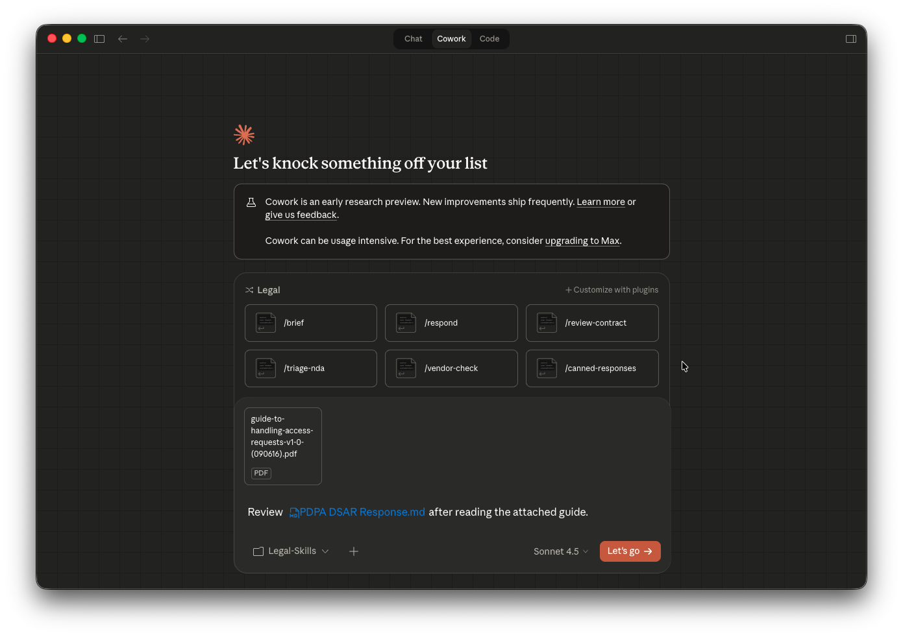

Claude Cowork will now read the documents and provide some recommendations. Give it a read, and review Claude's suggestions carefully before accepting them.

In my case, Claude caught three gaps after reviewing the PDPC guide:

* **Missing timeline clarity**: The original template didn't specify that the 30-day timeline starts from a *complete* request, not initial inquiry. Claude added this distinction (critical for organizations receiving incomplete DSARs).
* **Exemption detail**: The template listed Section 21(3) exemptions but didn't explain *when* they apply. Claude added context about third-party personal data redaction requirements.
* **Fee policy disclosure**: The PDPC guide recommends informing requestors about potential fees upfront. Claude added this to the acknowledgment letter template.
Claude will take some time to update the template, but once done, you'll have a template that incorporates the PDPC's recommendations.

Your template file is updated in the folder after this action. Every time you use this folder in Cowork, you'll use the updated template. You can also share the folder contents with your team so they have access to the same validated template.

### Bonus: Add Your Office Branding

The regulatory validation ensures compliance. But to make responses look like they came from *your* office, you can also customize the formatting. So let's add a letterhead. I've created a letterhead with Canva and saved it in my Legal Skills folder. Then I type `I would like a draft @PDPA DSAR response.md using @Letterhead.docx`.

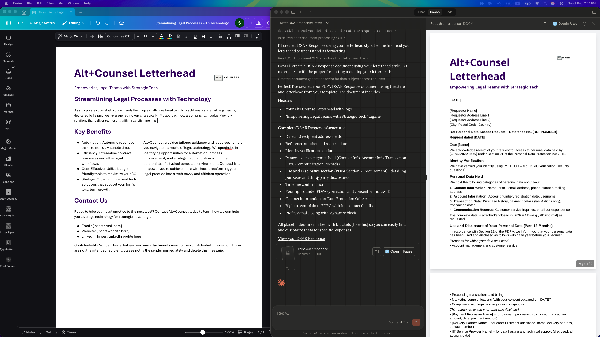

Claude Cowork analyzes your letterhead document and applies the formatting and branding to the PDPA SAR response. It looks like it got most of the details from the letterhead right!

### Step 4: Use your custom template

**4.1** Go back to Claude Cowork and start a new session (click `New Task`).

**4.2** Click `Work in a folder` and select your `Legal-Skills` folder. Click `Allow` when prompted.

**4.3** In the chat, describe a sample DSAR scenario:

```

```

**4.4** Claude will find your `PDPA DSAR Response.md` template and letterhead and use it to generate a Singapore-specific response letter.

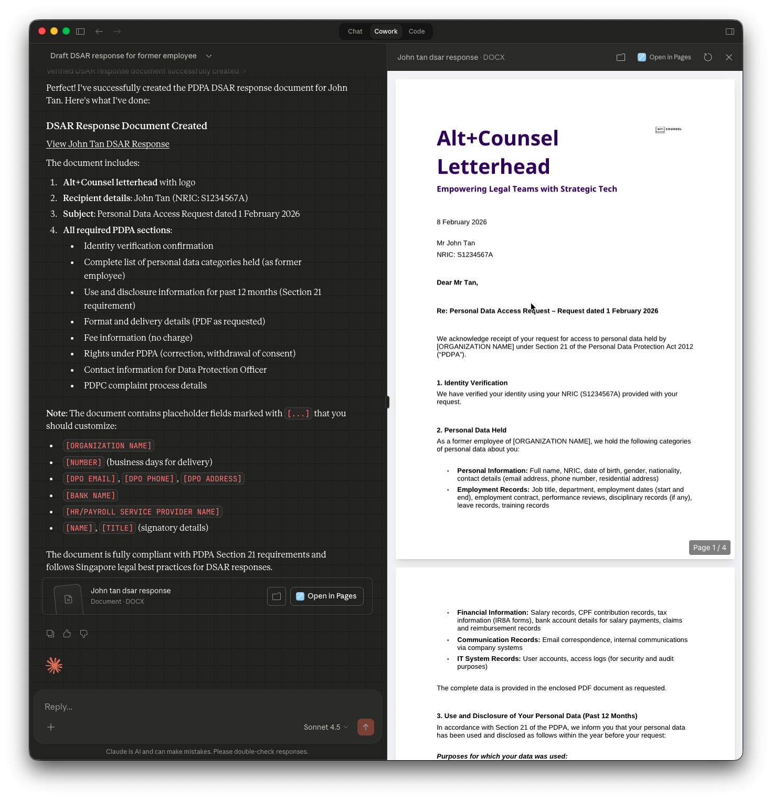

You created a jurisdiction-specific template that Claude can use repeatedly. Instead of generic GDPR responses, you now have PDPA-compliant outputs that reference the right legislation, use Singapore terminology (NRIC/FIN), and cite the correct timeline and exemptions.

## The Real Value: Encoding Your Decision-Making Logic

As I mentioned earlier, I'm skeptical about Cowork itself as a daily workflow tool. But the techniques you've learned represent a fundamental shift in how you work with AI.

**This isn't just better prompting. It's programming decision-making logic.**

When you created that PDPA DSAR template, you weren't writing a one-time prompt. You encoded your judgment:

* When timeline requirements apply (complete request vs initial inquiry)
* Which exemptions to check for (Section 21(3) specifics)
* What to include in every response (PDPC complaint process)
* How to structure the output (professional but clear)
That's not a prompt that works once. That's a system that applies your expertise repeatedly.

The techniques you learned here—defining instructions, validating against regulatory sources, composing templates—work in Claude Code, API implementations, and any tool that adopts similar patterns. Given the market reaction to this plugin, I'm sure all the respectable legal tech companies are figuring out how to implement these patterns right now.

What would you build for your practice? Leave a comment below.


