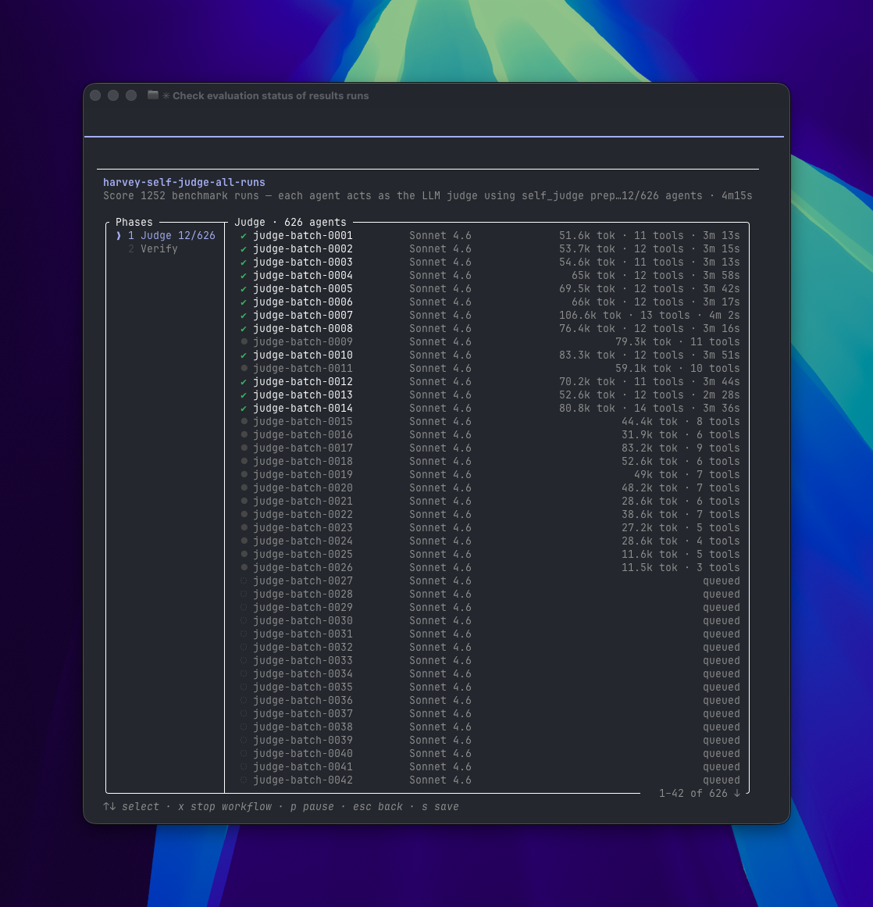
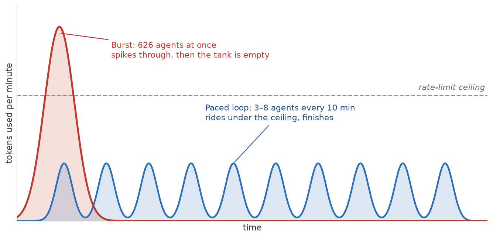

Three days into scoring the benchmark, my tokens ran out.

I didn't feel defeated. I felt determined to find another way — which, in hindsight, is the only reason I have anything worth writing here. I was running more than a thousand AI agents to answer a single question, and the wall I hit taught me something I keep coming back to.

When you run real AI work at scale, the model isn't the thing you're really choosing. The shape of the work is.

## The question you can't answer from a chat window

Every few weeks there's a new model, a new capability, a new score. Underneath the noise, the people I talk to keep asking the same quiet question: with all of this, how do I actually know what these models can do for *my* work?

You can't find out from a single chat window. One clever prompt tells you the model can do the thing once, on a good day, when you're watching. It doesn't tell you whether it holds up across a hundred real matters with the messy documents and the deadlines. For that you have to give it real work, at scale, and grade what comes back.

And there's a sharper reason one chat undersells a model. What a single instance manages on its own is only half the story. Put six hundred of them to work at once — grading in parallel, covering ground no lone agent could reach in a week — and the capability you're measuring changes. What AI can do isn't a fact about the model alone. It's the model *and* how you orchestrate it — the scheduling, pacing, and parallelisation you wrap around it.

A while ago I argued that lawyers had learned prompt engineering at exactly the wrong moment — that the tools had quietly shifted from things you prompt to systems that run in loops, and that we needed new ways of thinking to keep up.

[Lawyers Got Prompt Engineering Wrong (And Why That Matters)](https://www.alt-counsel.com/lawyers-prompt-engineering-wrong/)

Thinking in loops is one of those new ways. But it's confounding to say the least. For most lawyers, the work flows in a pipeline. Do A, then B and finally C. What does a loop mean? Do A over and over again? It sounds like an exercise in stupidity and it has been one of the hardest things to wrap my mind around (no pun intended).

## Same work, three shapes

Here is the work I was actually doing. I had 1,252 finished benchmark runs — legal tasks an agent had already completed — and I needed every one scored against the rubric. Tedious, mechanical, and far too much to read myself.

[My Agent Did the Legal Work. The Benchmark Gave It Zero.](https://www.alt-counsel.com/my-agent-did-the-legal-work-the-benchmark-gave-it-zero/)

I ended up doing that identical job three different ways. The difference between them is the whole point.

### The script

The obvious way to grade a thousand things is to write a script that loops through them. This is how Harvey, who built the benchmark, [runs it](https://github.com/harveyai/harvey-labs/blob/main/docs/tutorial.md) — and scripts can orchestrate enormous scale. But a script is a black box while it runs. When something goes wrong at run 800, it tells you very little; you're reading logs after the fact, not watching the work happen. For a job I didn't fully trust yet, that opacity was the general problem.

The specific problem was that I couldn’t use Harvey’s at all. Its script judged runs with Anthropic’s own API models, and I wanted to grade them with the Claude Code subscription I was already paying for. 

Rewriting it would only trade one set of problems for another — so I went looking for a shape I could both see into and actually run.  

### The burst

So I reached for a dynamic workflow instead — a [Claude Code feature](https://code.claude.com/docs/en/workflows) where, rather than doing the job itself, Claude writes a small program that hands the work out to a fleet of subagents and supervises them, adapted to the Claude Code interface. 

I told Claude Code that I had 1,252 evaluations to do in my folders and to use “workflows” to solve them. It split my 1,252 runs into 626 judge agents — separate Claude instances, each scoring about two runs against the rubric — running a dozen at a time. The judges were Claude; the work they graded came from a different model entirely, which if anything makes the scores more trustworthy than a model marking its own homework.

This was the opposite of a black box. I could open any single agent and watch it reason about a run. As the documentation puts it, a workflow "moves the plan into code" — the orchestration becomes something you can read, rerun, and inspect. The work had become legible.

It was glorious. It was also a flood. Six hundred agents firing as fast as the system allowed is like tipping a full bucket of water out at once — most of the capacity you're paying for just sloshes over the side. Three days in, the bucket was empty — my session budget, not any cap on the agents themselves. I kept hitting the limit, and spent more time waiting for it to reset than running the work. 

### The paced loop

When I had a chance at another go, I wanted some conservation of resources. I was also writing a presentation and other daily stuff in Claude Cowork. I definitely could not expend all my session usage for 5 hours within 30 minutes of a reset.

So I set a loop running:

1. Run the model against a task in Harvey LAB (the benchmark itself). These take time and vary (simple tasks take a few minutes, complex tasks take longer). Once they are done, they save their output in the folder, waiting for a judge to score them.
2. Separately I check for runs that hadn't been scored yet, and spin up an agent to grade them. These run on a ten-minute loop — `/loop 10m [prompt]`, a Claude Code command that re-runs a prompt on a fixed interval — so each pass picks up whatever is still outstanding. I never set that batch size; it was simply however many had piled up since the last pass — three to eight, as it turned out.
3. Each small batch finished before the next began, and each round left me a one-line summary so I could watch progress while I got on with other things. Same 1,252 runs. Same agents. Same judge. A completely different rhythm in time.

Drawn against the limit, the two shapes look like this:

The shape of *how* I ran them is what this post is about, and on that the three approaches sort cleanly:

| | Scripts | Burst (`Workflow`) | Paced loop (`/loop`) |
|---|---|---|---|
| Who holds the plan | the script | an orchestrator | the scheduler |
| Can you see inside? | barely | yes, agent by agent | yes, a summary each tick |
| Behaviour over time | opaque | one tall spike | steady ripples |
| Hits the wall? | maybe | fast | rides under it |
| Fits when | already battle-tested | budget, and you want speed | time or budget is the constraint |

## Why the slow way works

The loop isn't slower out of patience. It works because the limit I hit has a shape, and the loop matches it.

A Claude subscription doesn't meter you by the request. It gives you an allowance inside a rolling window a few hours long, with a larger weekly cap sitting on top. Spend that window's worth in one go and you're locked out until it resets. That's why the burst felt so wasteful: six hundred agents drained the whole window in minutes, and then I sat idle, waiting on the clock while the limit slowly crept back.

The loop spends differently. Three to eight agents every ten minutes is a steady sip — small enough that I stay under the ceiling for the whole window, with headroom to spare, so the work never stops and I keep enough in reserve to write a presentation in Cowork on the side. Same allowance, same ceiling. One shape pours it all out and stalls; the other paces itself and finishes.

Once you see it that way, pacing stops feeling like a compromise. It's just the shape that fits the constraint.

## The shape is the decision

Once you've settled on a model and built a decent harness, the shape of the work is the lever still in your hands — and it's a real decision, not a default.

Burst when you have budget to spend and you want the answer now. Pace when your usage limits, your budget, or your own attention are the thing in short supply. The burst gave me legibility and speed right up until it gave me an empty tank. The loop gave up the speed and kept everything else.

Neither is wrong. But choosing the wrong shape for your constraint is how you end up three days in with nothing scored — or how you wait a week for an answer you could have had in an afternoon.

## For the rest of us

The frontier labs answer "what can this model do?" in an afternoon, with a research budget and rate limits the rest of us will never see. For everyone else, the same question is now answerable too — the tools to run and grade work at scale are sitting in a CLI. But the shape that fits a small operation isn't the burst. It's the loop.

This isn't an abstract worry. Singapore's Minister for Law, pressed on why smaller firms struggle to adopt AI, [put it plainly](https://www.mlaw.gov.sg/written-reply-by-minister-on-supporting-law-firms-adopt-ai): enabling adoption "is not only about addressing cost," because many lawyers "are kept busy by their daily work, and may not have the capacity to dedicate additional hours" to it. The constraint isn't only money. It's time and attention.

A loop that runs while you work is a direct answer to exactly that. You don't sit and supervise a flood; you set a cadence, check the summary between matters, and let it grind through the budget you actually have. That is frontier-scale evaluation on a non-frontier budget.

For solo counsels and small teams, this is the part worth internalising. You will not win by buying the biggest burst. You win by knowing the question is testable at all, and by shaping the work so it fits the resources you have rather than the ones you wish you had.

And the shape doesn't only decide whether you finish — it decides what you can attempt. One agent grading 1,252 runs in sequence is days of babysitting nobody signs up for; fanning the work across hundreds made the whole set feasible instead of a sample. And only across the whole set did the real findings surface — which practice areas held up, which fell apart. Orchestration didn't just save me money; it put a question that used to need a research lab within reach of one person on a subscription. That's why learning to run these tools in concert is becoming a skill of its own — as much a part of the frontier as the model itself.

My tokens ran out three days into the benchmark, and the fix wasn't a bigger budget or a better model. It was a different shape — and the capability was already there, waiting for me to stop pouring it out all at once.

The model isn't the only thing you're choosing. What shape is your work running in?
