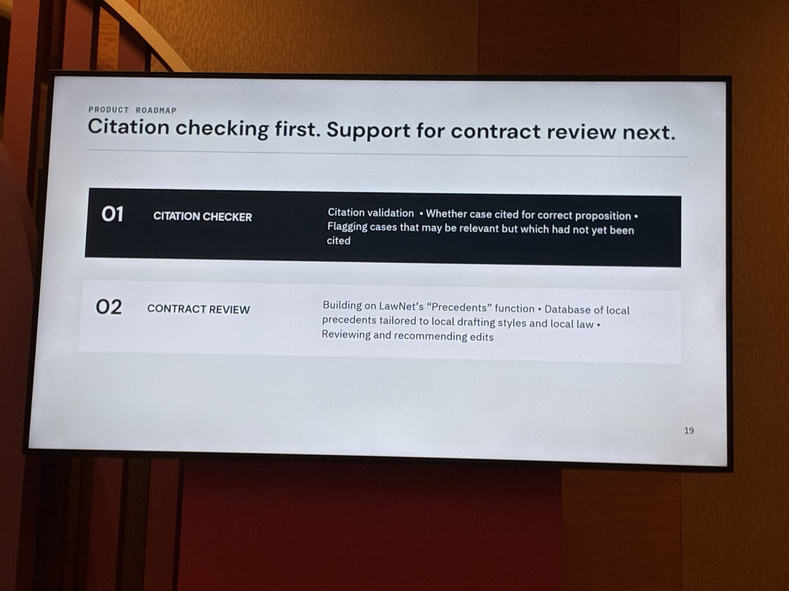

I have been a regular TechLaw.Fest attendee for many years. This year I have been gratified to meet new friends, especially from the LegalQuants community.

[Three Things: TechLawFest 2021](https://www.alt-counsel.com/three-things-techlawfest-2021/?ref=the-bigger-bookcase) 

TechLaw.Fest is also important for meeting old friends, and this friend is a really old one. Someone I knew fondly since I was a law student and who has stood shoulder to shoulder with me as an associate. We stopped meeting each other when I left practice. As such, TechLaw.Fest is the only time I get to check on how he or she or it is doing. 

LawNet is the Singapore Academy of Law’s national legal research service. It started in 1990 as a dial up network (what in the world is that?) and has roughly 10,000 users, including more than 75% of Singapore lawyers in private practice. It’s roughly what I would call the LexisNexis or WestLaw of Singapore, covering judgments, legislation and secondary materials. Even though it runs by subscription (you can check it out on demand at a counter in the National Library), it is as close to what you can call the national infrastructure for Singapore law.

I dare say it punched above its weight. If you only practiced Singapore law, as many lawyers in small and medium sized law firms here do, LawNet was all you need. It implemented boolean search, natural language search, results from multiple databases and so on. No more trips to the library searching for cases or figuring out where some law students were hiding important books in the law library. (What’s a book?)

Obviously, the world has moved on a lot. I have long been curious how LawNet would respond to AI with every TechLaw.Fest. This year I started to worry that the answer is a bookcase, nothing more, nothing less. 

## What a year produced

LawNet 4.0 launched at TechLaw.Fest 2025. On day two of TechLaw.Fest 2026, from the same podium, the Singapore Academy of Law set out what the year since had produced.

- The AI Q&A, originally tuned for contract law, now covers all areas of Singapore law
- Academy Publishing books are now searched alongside cases and legislation
- The legislation module has been marked up for ten key statutes, including the Penal Code and the Evidence Act
- AI-generated annotations extract legal principles for a given statutory provision
- A partnership with LegalOn Technologies to push Singapore corporate content into other platforms
- A revamped Sentencing Information and Research Repository, coming next year

Five of those six are more content, or content arranged more neatly. None of them does a piece of work for you.

You don’t have to read release documents or attend TechLaw.Fest every year to see what is happening. Compare the interface from before and after LawNet 4.0, and you can see the density of the screen is getting thicker, not thinner. That’s what it looks like when the bookcase is expanding. Do I really need to read dozens of annotations from cases on whatever provision there is on a statute? And now books?

[Budget 2026 Tells Lawyers to Use AI. But Are We in the Driver's Seat?](https://www.alt-counsel.com/budget-2026-lawyers-ai-drivers-seat/?ref=the-bigger-bookcase)

## What I wanted

I am not interested in whether my old friend turns into one of the global vendors. I wanted it to find its own answer, and it is not for lack of effort that it hasn't. People worked very hard on 4.0 and continue to do so. They ran feedback sessions and bought lunch to get practitioners into a room. There are people at LawNet who clearly want it to succeed. There may also be more passionate users of LawNet than the team expects.

Part of an answer was presented at the same conference. On day two, on a side stage, a team of Justices' Law Clerks presented their research on how AI is changing legal practice. A number of the practitioners they interviewed had never heard of or accessed LawNet.com and LawNet AI, the platform that came with 4.0. The old LawNet site is still running, which may explain some of that. They did not stop at the diagnosis. They proposed a roadmap: a citation checker that tells you whether a case is being cited for the proposition you are citing it for, and then contract review built on LawNet's own Precedents function.

## Haves and have-nots

For a small firm, LawNet was the equaliser. I was up against a law firm and their army of interns. Whatever point I thought of, they could find more cases to cite, or even cases to override my point. I could never match their output. But what I couldn't match in productivity required me to be more efficient and effective. This needed me to be a deft user of LawNet, and I appreciated its citator functions. Sometimes I won the case and sometimes I lost, but it was never because I couldn't put my best case forward.

AI is the new army of interns. In the twelve months that LawNet spent adding books to its search box, LexisNexis shipped a new generation of Protégé and Thomson Reuters shipped what it calls a fully agentic CoCounsel. Both were shown off at TechLaw.Fest. Start-ups like Harvey and Legora sell the same kind of tool. These are agentic workspaces. They don’t just find the case for you; they do the work with it.

Firms that can afford Harvey, or CoCounsel and Protégé at what are now probably higher prices, will be fine. The have-nots will rely on meat computers.

[Beyond the Harvey Drama: The Real Lessons for Solo Counsel](https://www.alt-counsel.com/beyond-the-harvey-drama-the-real-lessons-for-solo-counsel/?ref=the-bigger-bookcase)

They will also find it harder to hire. In June, NUS Law became the first law school in Singapore to partner with Harvey. On 9 September, the opening day of TechLaw.Fest, SMU’s Yong Pung How School of Law joined Legora’s Legal AI Scholars Program. The next lawyers are learning their craft on these tools, and they will expect to find them at work. A firm that can offer them only a bigger bookcase will struggle to attract them.

There is an irony here. As smaller firms struggle to pick up legal AI tools, those that do reach for AI will reach for consumer tools like ChatGPT, the same tools litigants in person have no qualms using to do their work before the courts. What difference is there between a litigant in person with ChatGPT and a firm that uses ChatGPT? I am sure the legal fraternity and the courts know the answer to that, but a first-time client will not.

If this is the direction LawNet is going to take, it will clearly be left behind. The firms that depend on it will be left behind with it, and we will have a profession of haves and have-nots, where what a lawyer can do for a client depends on what the firm can afford. That is a foreboding future, not just for LawNet but for legal practice in general.

I will be back at TechLaw.Fest next year to check on my old friend. I always wonder if it will be the last.
