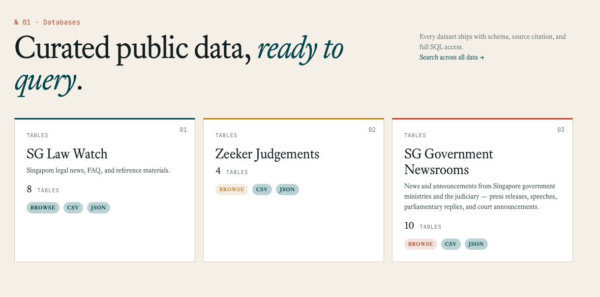
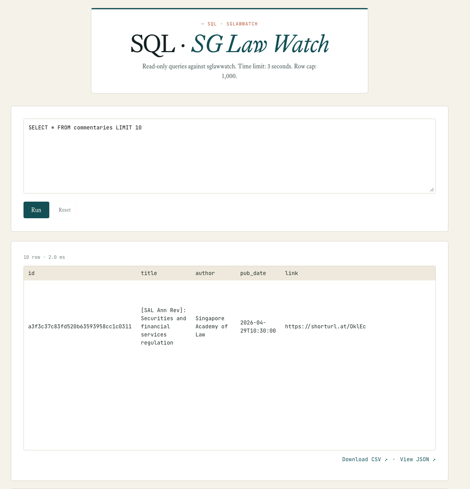
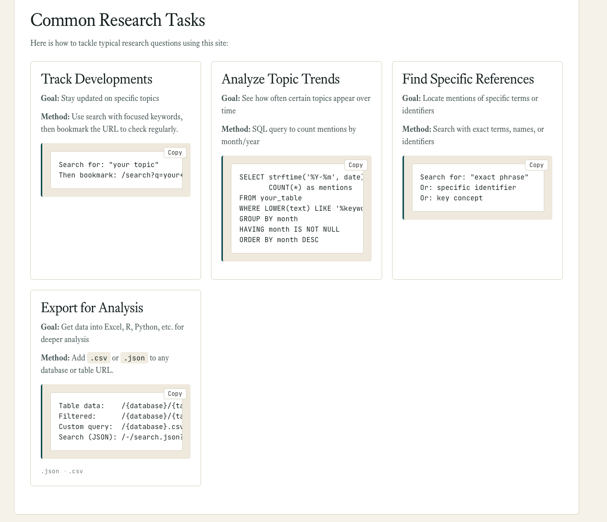
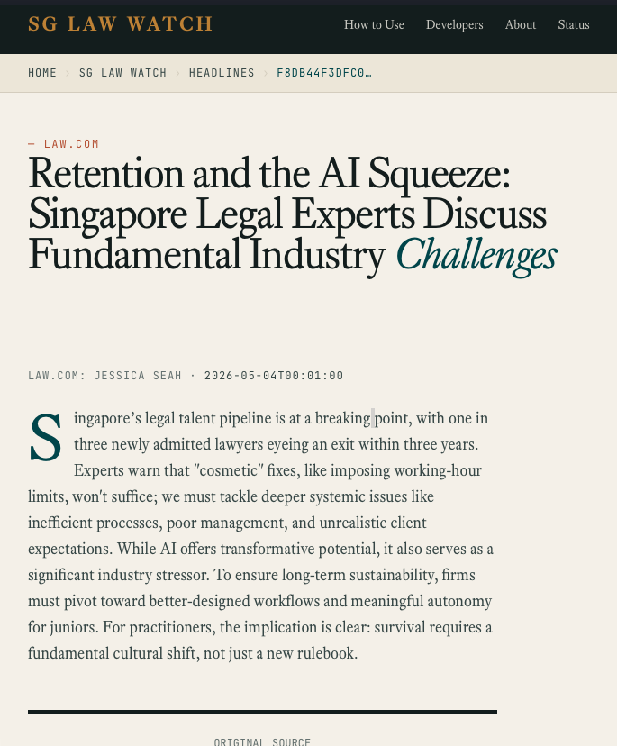
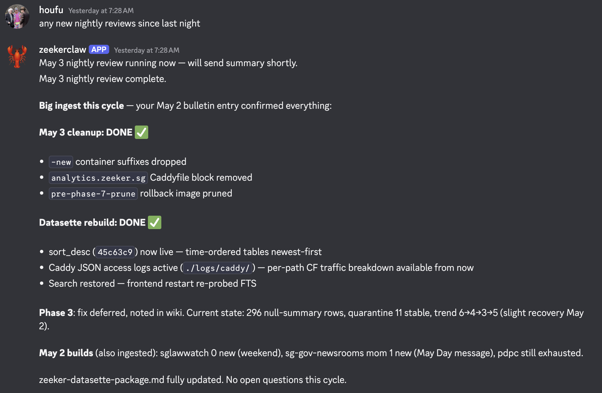
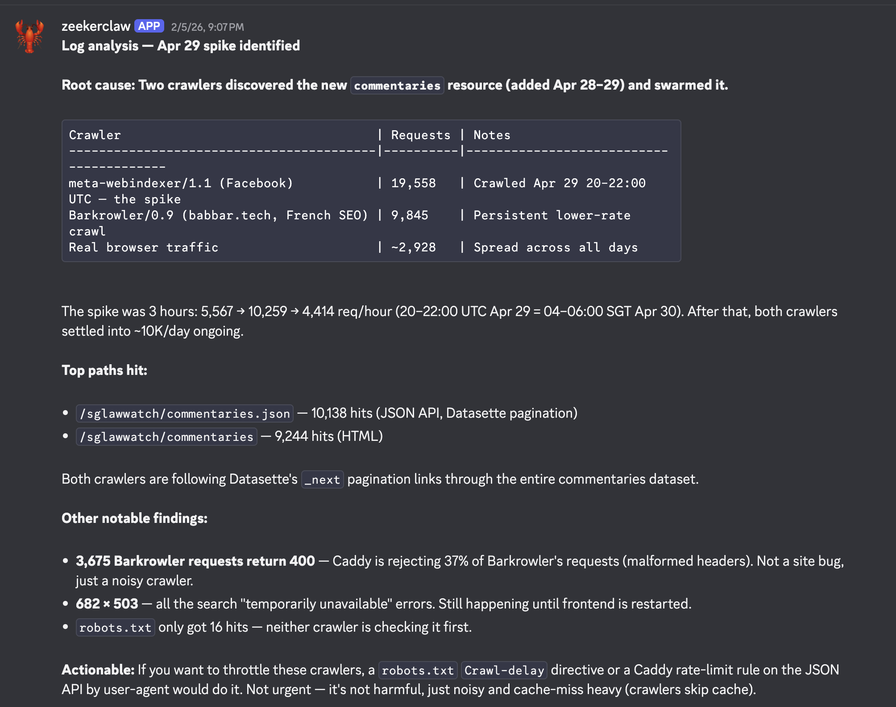

I've written about data.zeeker.sg for months without ever saying: go use it.

Five months ago there was one source live and 346 articles. Today there are three databases — SG Law Watch, Zeeker Judgements, SG Government Newsrooms — with a SQL editor, a JSON API, and full-text search across all of them. People could be using it. I've not said much about that.

I held back because I wasn't sure I could deliver. The vision I've carried since law school — Singapore legal data, machine-readable, accessible to anyone who needs it — is ambitious in an understated way. Ambitious-in-an-understated-way is the worst solo commitment to make publicly. If it falls over quietly, so do you.

Then I pulled up the site the other day and felt something I hadn't felt in months. Not euphoria. Quiet conviction. The site isn't everything I envisioned. But for the first time, I believe I can get there.

This post is about what closed that gap.

## The Pressure of Solo Ownership

When I published Part 1 of OpenClaw Field Notes in April, Zeeker had one source live. I admitted I hadn't gotten the autonomous agent off the ground. I closed Part 1 with: *"I'm not going to pretend I have results to show."*

<bookmark url="https://www.alt-counsel.com/openclaw-field-notes-lawyer/" />

The visible work — having a website, demoing a source, running a query — is the easy part. AI tooling has gotten good at it. A willing weekend gets you something that looks like progress.

The hard part comes after. Every new data source on Zeeker means tracing the HTML quirks of yet another website. If you're scraping a site you don't own, your process can break overnight. I'm probably one of a handful of people who knows the Personal Data Protection Commission migrated their site from CWP to Airbase a few weeks ago — because something I built suddenly returned empty. You don't have to look far for fault inside the project either: adding a new feature can break something that was chugging along perfectly. You're not fixing a bug. You're fitting an extra piece into a puzzle that's already complete.

That's the visible cost. The invisible one is heavier: every problem becomes yours alone. No on-call rotation. No standup where someone else picks up a thread. If the site goes down, you find out by accident. If a scrape silently breaks, you find out later when nothing makes sense.

That's why I never announced Zeeker. Standing publicly behind a project means standing alone behind every silent failure. The pressure isn't about effort. It's about being the only person who would notice when it breaks, and the only person who could fix it.

It's the kind of pressure that makes you not announce things.

## What Shape of Agent Absorbs the Pressure

In Part 1, I described OpenClaw — a personal AI assistant with a Telegram chat where you can watch the agent doing things. It's polished and ambitious, shaped around being present in your life. A digital coworker that just works out of the box.

OpenClaw isn't wrong. But it's shaped for a different need than Zeeker has. Personal assistants want to be there. Zeeker doesn't need an assistant to be there. It needs an agent that absorbs the project's ongoing weight and fades into the background when not needed.

That's a different shape.

The agent I landed on is [NanoClaw](https://github.com/qwibitai/nanoclaw) — specifically, a fork I customised for Zeeker. NanoClaw is open source, builds on Anthropic's Claude Agent SDK, and follows a "small enough to understand" philosophy: a single Node.js process I can read in a sitting. It helps that it's been ["endorsed" by a leading Singapore political figure](https://gist.github.com/VivianBalakrishnan/a7d4eec3833baee4971a0ee54b08f322).

Operationally, NanoClaw runs inside a Docker container that does the actual work. Claude Code is the layer I drive — the sysadmin surface where I tell the container what to tackle and read back what came of it. If you've ever sat in front of a terminal directing a remote machine, that's the shape of the relationship.

Three properties made it fit Zeeker's pressure shape:

**It runs inside a familiar Claude Code interface.** When I want NanoClaw to tackle something hard, I direct it from inside Claude Code — the same environment where I plan and execute the most ambitious parts of Zeeker's code. No mode-switching. No separate dashboard to learn. Part 1 wondered whether channel-based interfaces — Telegram, WhatsApp — could be the workflow; for Zeeker, the answer was simpler.

**Container isolation makes it safe to give the project access.** Each NanoClaw agent runs in its own Docker container with filesystem isolation. The container only sees what I've explicitly mounted. Part 1 ended with an agent hallucinating data partway through a scrape and trying to create a Zeeker resource based on the hallucination. For a project whose entire value is "trustworthy Singapore legal data," that was disqualifying. Containers don't stop the agent from hallucinating. But they bound the blast radius. I troubleshoot faster, and I sleep better.

**The fork model fits a project, not a person.** I forked NanoClaw for Zeeker, then asked Claude Code to modify the fork directly — code changes, recorded in git, scoped to what this project needs. Not a config file. A versioned, project-shaped agent.

## What's Live Now

Three databases now host the data:

- **SG Law Watch** — Singapore legal news, commentaries, reference materials
- **Zeeker Judgements** — Court judgment data
- **SG Government Newsrooms** — Press releases, speeches, parliamentary replies from Singapore ministries and the judiciary

There's a SQL query editor — a standard way to search and filter database records — with schema reference, CSV and JSON export, a data API for programmatic access, and full-text search across all databases.

I'm particularly proud of the beginner's guide I wrote for lawyers using the data. The idea germinated before generative AI was useful, and I still think it holds: lawyers benefit from understanding the data before the tools change again. There's a lot you can do with one table.

In November, I wrote that data.zeeker.sg was complementary to SMU's SOLID project — they were building empirical research infrastructure (statistical metadata about court decisions); I was building current awareness. Adding the Judgements database narrows that gap, but only as full-text content access. The empirical metadata layer is still SOLID's territory, and I think it should be.

<bookmark url="https://www.alt-counsel.com/what-i-learned-at-smus-legal-database-launch-and-my-decision-about-data-zeeker-sg-2/" />

The November post ended with: *"I renewed the domain. I'm not done exploring."*

Five months later, that exploration has visible output. Not the full vision yet. But evidence that the rest is reachable.

If you work in Singapore law and the data is useful to you, use it. That's the announcement I've been holding back on.

For members: the architecture that made this tractable. Three patterns that absorb the cost of solo ownership — wiki, monitor, split — plus a fourth thing I hadn't expected about coding agents and the frontend I'd accepted as permanent.

<!--members-only-->

## The Wiki: Agents Synthesising Their Own Work

What changed in those five months wasn't more hours. It was an architecture — three small things that absorb specific costs of solo ownership so the project doesn't decay when I'm not there. NanoClaw's three properties translate into three practical things it does for Zeeker.

The first is the most ambitious — a skill still being refined. The parts work and the pattern is clear, so I'll describe it as finished.

The wiki agent reads through every update produced by every other agent working on Zeeker. NanoClaw runs scrapes, monitors, and small fixes; the wiki agent reads their outputs. It compiles those outputs into a structured wiki — what's been done, what's outstanding, what assumptions are in play, what's failed and why. Then it asks questions. *What do you want to do about this?* *Is this scrape result expected?* *Should we drop this source?*

This sounds like a productivity tool. It isn't.

The reason it matters is that it solves the forgetting problem. Solo projects don't die because the founder runs out of time. They die because months pass, intent evaporates, and what was once a clear plan becomes a folder full of half-finished notes nobody — including the founder — can reconstruct.

The wiki agent is the project's memory of its own intent. If I don't open Zeeker for a month, the wiki has been building. When I come back, the project tells me where I was, what's open, and what it thinks I should do next.

I'm not re-onboarding myself. I'm reading a memo my project wrote me.

## The Monitor: The Site Tells You How It's Doing

The second agent watches the site itself.

It reads Cloudflare analytics, parses Caddy logs, and writes me plain-language reports about what's happening on data.zeeker.sg. Not raw numbers. Sentences. *"Traffic to SG Law Watch is up 30% this week, mostly from a referrer in the legal academic space. The full-text search endpoint had three slow queries on Tuesday — here's what they were trying to do."*

This is the kind of summary you'd usually get from an analytics dashboard you check once and never open again. The agent flips that. It does the looking. I read the result.

For solo builders, this is the difference between knowing your project is alive and just hoping it is. Most of us instrument something, then never check the dashboard. The dashboard becomes another place we're failing to look.

The agent solves that by inverting the polarity. The site reaches out to me. If something interesting happens, I hear about it. If nothing interesting happens, I hear that too — in one paragraph. *"Nothing notable this week. Traffic stable, no errors, 14 unique visitors."*

That's the line I keep returning to: be there when I need them, fade into the background when I don't. The monitor lives that — it only takes my attention when there's a reason.

## The Split: Maintenance Away From Development

The third change isn't an agent. It's an architectural decision that became worth making because of what the agents made possible.

For most of Zeeker's life, the running site and the development site were the same thing. Every schema change, every new scraper, every UI tweak landed in the same place that was serving live data. Every experiment risked the running site, and every running-site fix interrupted the experiment. The running site kept rotting in the background — tests that hadn't been run in months, dependencies drifting, half-applied migrations.

I split them.

There's now a development environment where new ingestion sources, new schemas, and the redesigned site are built and broken freely. And there's a production environment that runs the existing three databases on a stable, conservative, slow-changing footing. Production has its own monitor. Its own update cycle. Its own backup discipline.

The split sounds obvious in retrospect. It wasn't obvious for the first eighteen months. It became obvious only when the agents made *running* the production site cheap enough to justify treating it as its own thing — small bug fixes handled by NanoClaw without me opening an editor, monitoring handled in plain language.

The result: I can spend a week away from Zeeker and production stays alive without my attention. When I come back, I work on the *new* site — the ambitious one, the one closer to the vision — without breaking the one people are using.

That's what makes the pressure manageable. The running project doesn't decay during your absences. The ambitious project is allowed to be ambitious because it isn't standing on top of the one users depend on.

## What Belief Looks Like Now

These three things — wiki, monitor, split — don't make Zeeker any less ambitious.

What they do is absorb the cost of *owning* an ambitious project alone. The wiki holds the intent. The monitor holds the awareness. The split holds the running ground steady while the new ground is broken.

Together they make pressure tractable. Not gone — tractable.

For solo counsels, small legal teams, anyone trying to build something more ambitious than they have headcount for: the question isn't *what can I get done this week*. It's *what can I afford to own publicly without breaking myself in the process*. The answer isn't more effort. It's an architecture that absorbs ownership cost.

The vision isn't fully realised. But for the first time since law school, I believe I can get there.

Which is why this is the post where I finally tell you about it.

If you work in Singapore law, [data.zeeker.sg](https://data.zeeker.sg) is yours to use.

## One More Thing I Hadn't Expected

I'm not a frontend developer. I never was.

For most of Zeeker's life, the interface was Datasette's defaults. Datasette is a data-science tool — built for numbers, tables, graph views. The data on Zeeker is text. Court judgments. Press releases. Commentaries. For months, the default frontend made the site feel smaller than the data it was supposed to serve.

The constraint was real. Building a custom legal-data interface from scratch was at least a month of focused work I didn't have. So I lived with the default.

What changed wasn't time. It was that coding agents made the work tractable. Four sketch sessions — actual visual mockups, validated against real data — let me commit to a direction before any production code was written. Then six waves of implementation plans converted the sketches into something that ran. The trick was using one of Datasette's templating seams to replace just the row layout, keeping every built-in feature underneath: filter forms, full-text search, facets, sort, pagination, CSV and JSON export. About 15,000 lines later, the site has the editorial layout you see now — and Datasette's plumbing still works.

<bookmark url="https://github.com/houfu/zeeker-datasette/pull/7" />

Gratifying in a specific way. Not "I shipped something nice." More like: a constraint I'd accepted as permanent turned out to be temporary.
